# The Pizza Hub

Developer: Jyoti Yadav

[View live website](https://the-pizza-hub.herokuapp.com/)

The Pizza Hub website has been developed to provide users the chance to order Pizza for home delivery or pick-up via a command line based interface.

## Table of Contents

1. [Project Goals](#project-goals)
    1. [User Goals](#user-goals)
    2. [Site Owner Goals](#site-owner-goals)
2. [User Experience](#user-experience)
    1. [Target Audience](#target-audience)
    2. [User Requirements and Expectations](#user-requirements-and-expectations)
    3. [User Stories](#user-stories)
    4. [Site Owner Stories](#site-owner-stories)
    5. [User Manual](#user-manual)    
3. [Technical Design](#technical-design)
    1. [Structure](#structure)
    2. [Flowchart](#flowchart)
    3. [Data Models](#data-modals)
4. [Technologies Used](#technologies-used)
    1. [Languages](#languages)
    2. [Framework and Tools](#framework-and-tools)
    3. [Libraries](#libraries)
5. [Features](#features)
    1. [Existing Features](#existing-features)
    2. [Future Implementations](#future-implementations)
6.  [Python Valiadation](#python-valiadation) 
7. [Testing](#testing)
    1. [Validator Testing](#validator-testing)
    2. [Testing user stories](#testing-user-stories)
8. [Bugs](#bugs)
9. [Deployment](#deployment)
10. [Credits](#credits)
11. [Acknowledgements](#acknowledgements)

## Project Goals

### User Goals

 - Be able to easily interact with the app to order pizza for pick up or home delivery.
 - Navigate the app seamlessly.
 - Receive clear instructions on their current input options.
 - Be able to add and remove items from an order prior to order confirmation.
 - Be able to cancel the order.
 - The ability to preview their order.
 - Be able to quit the app from any page.

### Site Owner Goals

 - To save the user information and order data to a Google Sheets worksheet.

## User Experience

### Target Audience

 - People looking to have pizza ordered for home delivery.
 - People looking to pick up pizza from the store.

### User Requirements and Expectations

 - The ability to seamlessly navigate through the app.
 - To have a well organized menu.
 - To have a easy ordering process.
 - To have validation that inputs have been successfully entered.

### User Stories

#### Site User

1. As a user, I want to be:
    - provided with clear instructions throughout the app.
    - able to choose my order between pick up or home delivery.
    - able to view the menu.
    - able to add items to my order.
    - able to remove items from my order.
    - able to preview an order.
    - able to cancel an unplaced order.
    - able to place an order.
    - able to see an order receipt.
    - able to exit the app.

#### Site Owner

2. As a site owner, I would want:
    - users to be greeted with a welcome message to give a friendly feel to the app.
    - to save the user information and order data to a Google Sheets file.
    - users to get feedback based on their input.

### User Manual

Instructions

#### Overview

The Pizza Hub app is for users who wish to place orders for home delivery / pickup.

----

#### Home Page

The home page opens with the store name "The Pizza Hub". A welcome page greets the users and asked if they would like to make an order. Users will be provdided with 2 options: Yes and No. Selecting yes will take the user to the main screen while selecting no will exit the app.

----

#### Main Page

The purpose of the main page is to get the user details. Users are asked to provide their name and choice of delivery type. If a home delivery option is selected then home address is also asked.

----

#### Menu page

On the Menu page users are provided with a table format of the menu with the range of items available for order. Users will be provdided with three options.

  - Item number -  To add the item to the order, users will be provided with feedback showing their selected item has been added to the order list and also a warning message if an invalid input has been entered.
  - Q - To cancel order, view thank you message and exit the app.
  - P - To preview the current order.

  ----

#### Preview page

The preview page shows the user's selected order list in a table format. The table shows the item details like item name and price. Also it provides user four options.

  - Item number - To remove any item from the list by entering item number. Invalid input will be warned with a message.
  - A - To add more item, user go back to menu page.
  - C - To confirm the order after preview.
  - Q - To cancel order, view thank you message and exit the app.
  
  ----

#### Receipt page

The receipt page is shown when the user confirms the order. Receipt page displays user's order with their name, unique order ID, order type, address, order time, delivery / pickup time and total price of the order. Quit option is shown along with a thank you message.

----

[Back to Table Of Contents](#table-of-contents)

## Technical Design

### Structure

This app was designed using Code Institutes Python Essentials Template. The template creates a command line interface within a blank page with a run button located above the command line interface. As this project is only intended for use on large screen devices there was no need to incorporate responsiveness to the page. On arrival to the page, the user will be presented with a welcome message and instructions on user input choices.

### Flowchart

The following flowchart was created to help identify functions that would be required in the Python files.

Overview

### Data Models

  - Lists and Sets- This project uses lists and sets to aid the storage of data from the Google Sheets file to variables and vice versa.

  - Google Sheets API - Google Sheets was used in this project to store all required data outside the container.

## Technologies Used

### Languages

- Python 3 - Used to create the command line based app.

### Framework and Tools

 - Git - Used for version control.
 - GitHub - Used to deploy the projects code.
 - Gitpod - Used to develop and test code.
 - [lucidchart](https://www.lucidchart.com/) Used to create the project flow.
 - LibreOffice Draw - Used to create the flowchart.
 - Google Sheets - Used to store data outside of the program with the User data, food menu and sales records stored on separate worksheets.
 - Google Cloud Platform - Used to manage access permissions to google services such as google autho and google sheets.
 - Heroku Platform - Used to deploy the live project.
 - PEP8 - Used to validate code against Python conventions.

## Libraries

### Python Libraries

 - os - Used to determine operating system and clear CLI.
 - time - Used to create a delay effect.
 - datetime - Used to get current time stamp and assign times to orders.

### Third Party Libraries

 - tabulate - I used this library to output lists in a table format enhancing user experience and overall readability.
 - termcolor - I used this library to give colour to user feedback and instructions.
 - pyfiglet - I used this library to generate the text art messages.
 - gspread - I used this library to add, remove and manipulate data within my Google Sheets worksheets and to interact with Google APIs
 - google.oauth.service_account - I used this library to set up the authentication needed to access the Google API and connect the Service Account using the Credentials function. From this a cred.json file was generated with all details needed for the API to access the Google account. This information is then stored in the config var section when deploying to Heroku.

## Features

### Existing features

### Welcome message

The welcome message is featured on the home page and will greet users with a friendly message.

Welcome message image

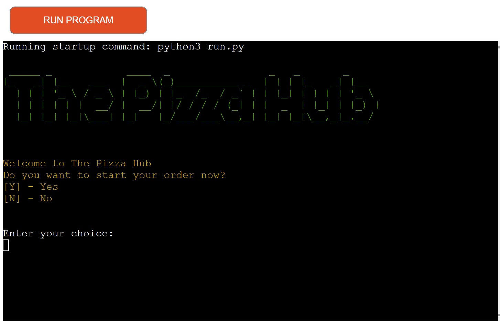

### Welcome message invalid input feedback

The welcome message invalid input feedback is featured on the welcome page and will alert users of an invalid option entry.

Welcome message invalid input image

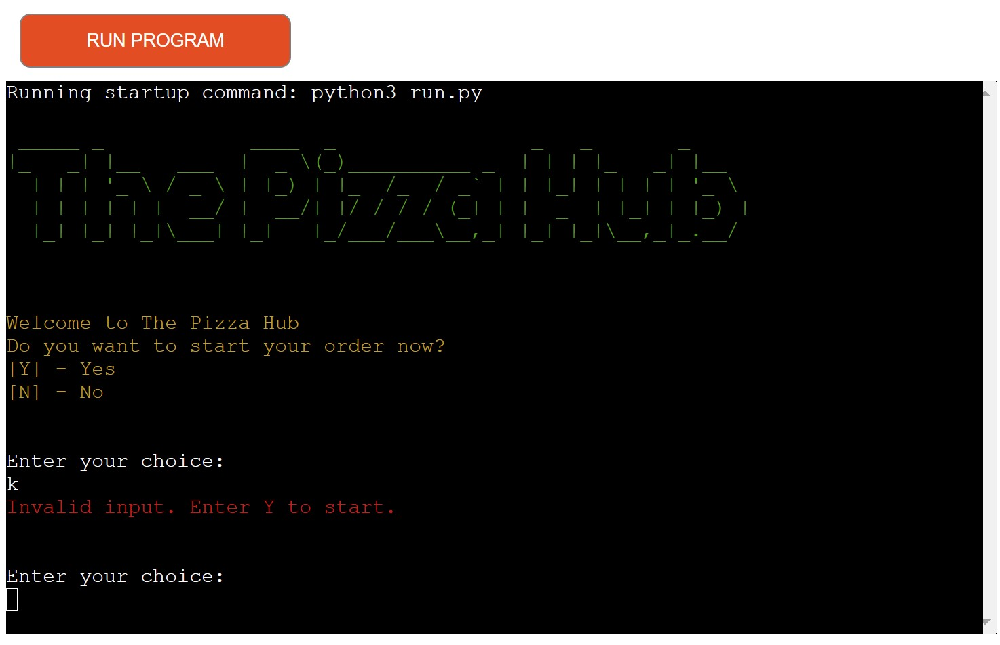

### User Name and Delivery Type Option

This page asks users to provide their name. Once user provides the name, a welcome message displayed with user's name and delivery type options. One option is for home delivery and another is for pickup. Pickup will auto populate the address as 'The Pizza Hub'. For home delivery, customers will be asked to enter their address.

User details image

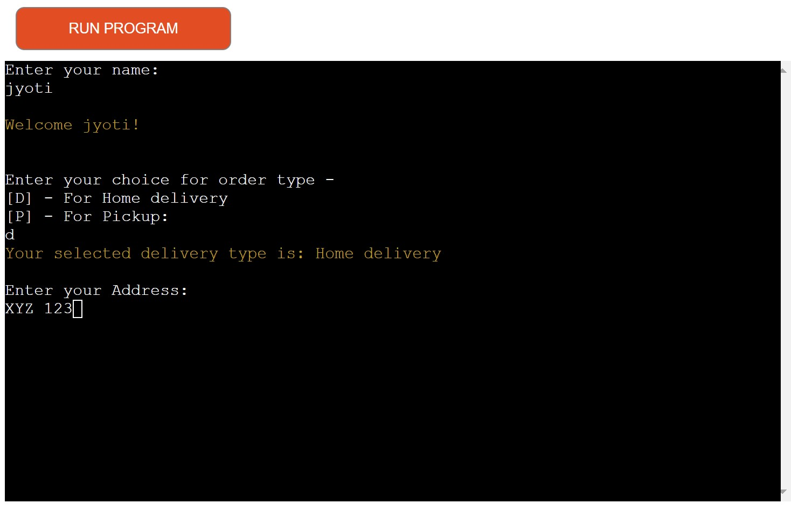

### Invalid delivery type feedback

If user input is other than 'D' and 'P', a invalid delivery type feedback is displayed.

delivery type image

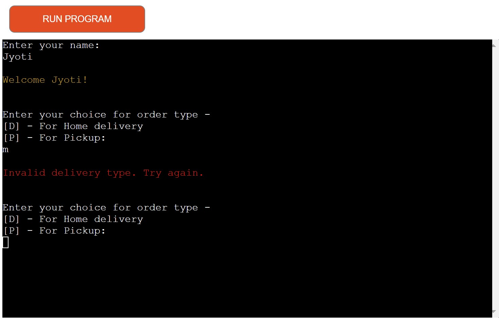

 ### Menu
 
The Menu feature will display a tabulated format of all items available for order. The menu has three options: Add item, preview order, quit.

Menu img

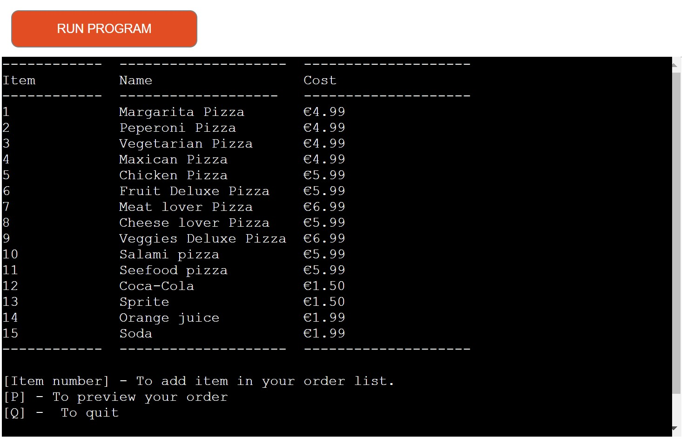

### Add item to order

The Add item to order feature on the Menu page allows users to add an item to their order by typing the relevant item number as displayed on the menu.

Add item to order image

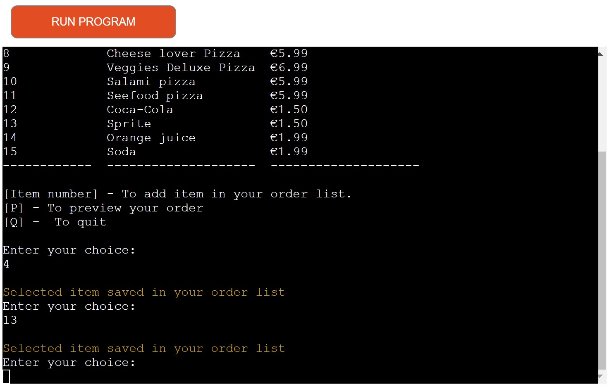

### Invalid item for order

The Invalid item feature on the Menu page warns users that their previously entered input is not valid.

Invalid food item number image

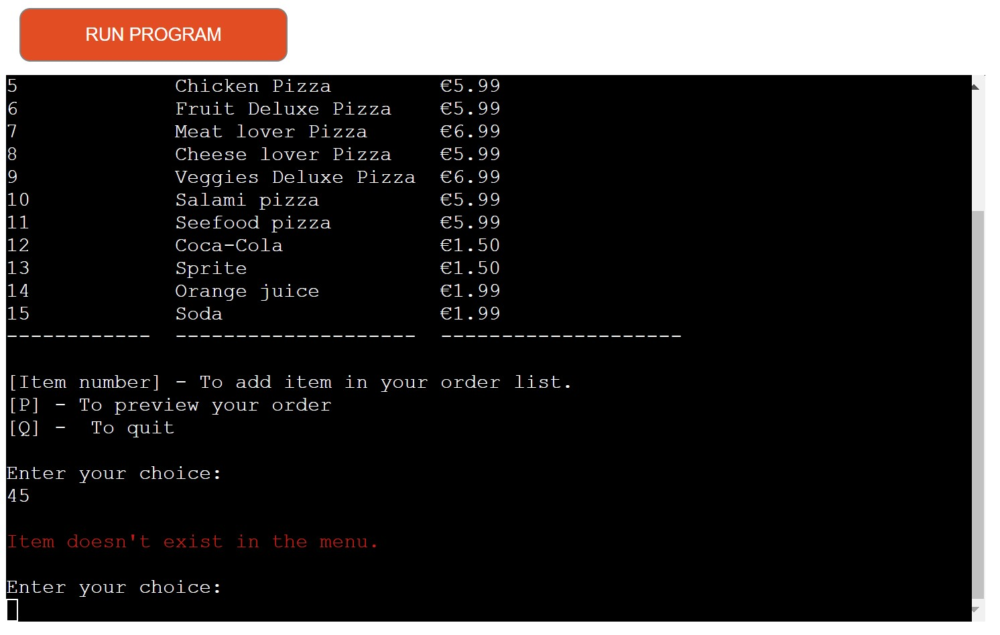

### Empty order list warning

The empty order list warning feature on the Menu page will warn users that their order list is empty, therefore no preview is possible.

Empty list warning image

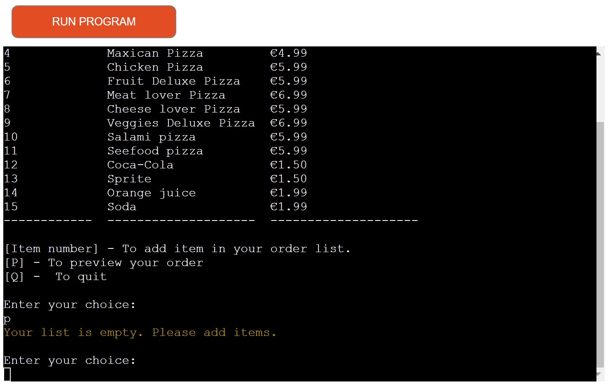

### Preview order

The preview order feature on the Menu page allows users to preview the items currently added to their order.

Preview order image

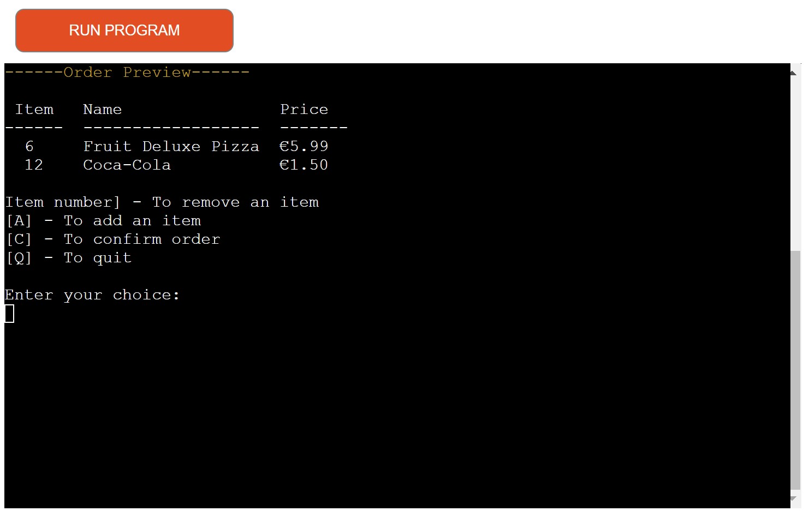

### Remove item

The remove item feature on the preview page allows users to remove any selected item from user's order list.

Remove item image

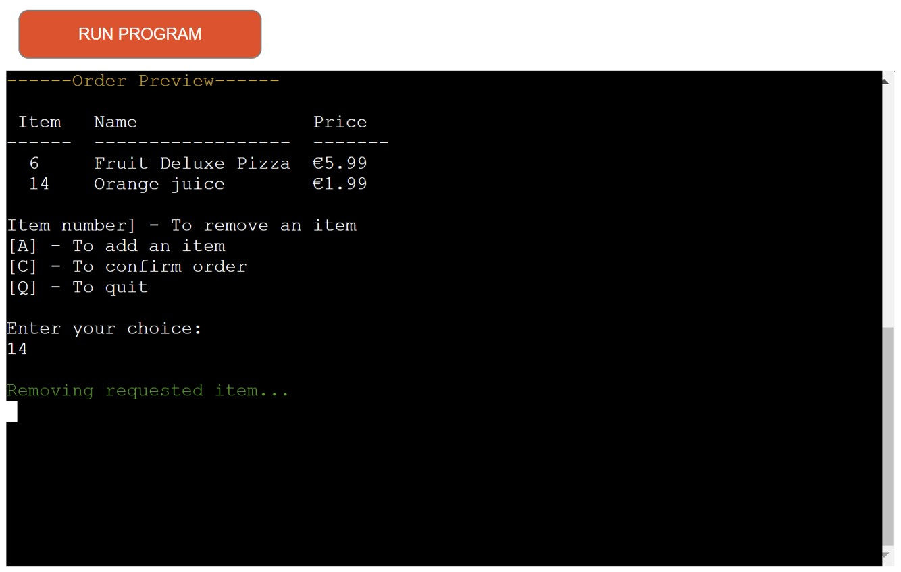

### Confirm order

The confirm order is a feature that will allow users to confirm the order and allows us to generate the receipt.

Confirmation order image

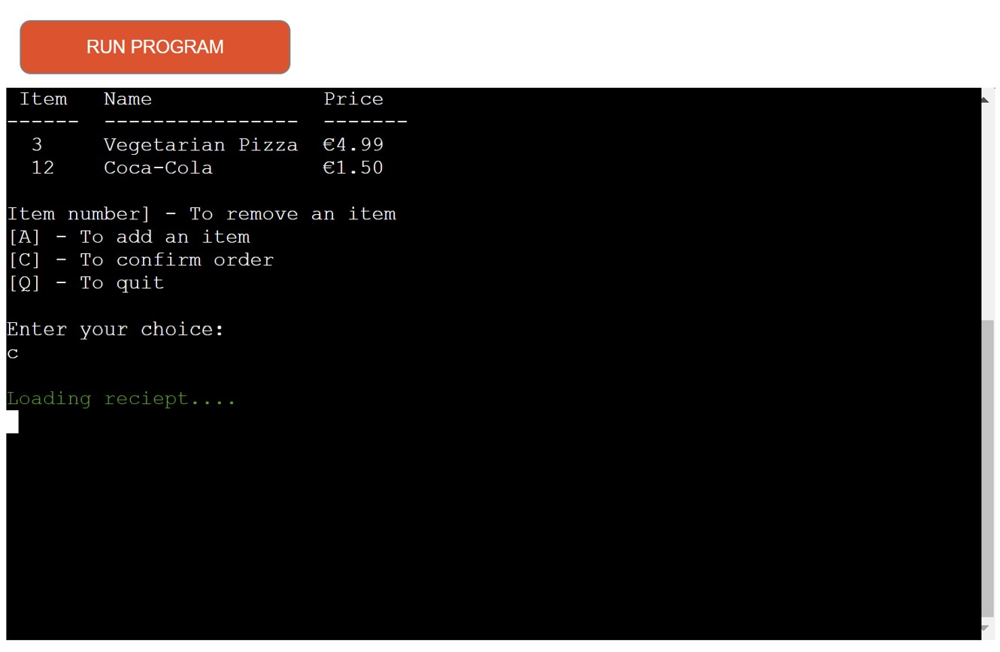

### Display order receipt

This feature is displayed upon order completion. It includes all information which had been gathered throughout the process such as user name, delivery type, address and item ordered.

Display order receipt image

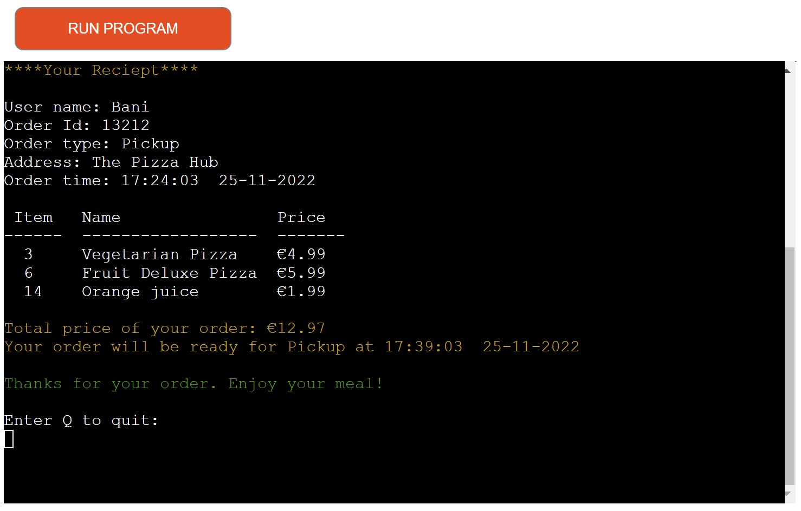

### Delivery charge

This feature adds a delivery cost if the order is for delivery and adds nothing if it is for pickup.

Display delivery charge image

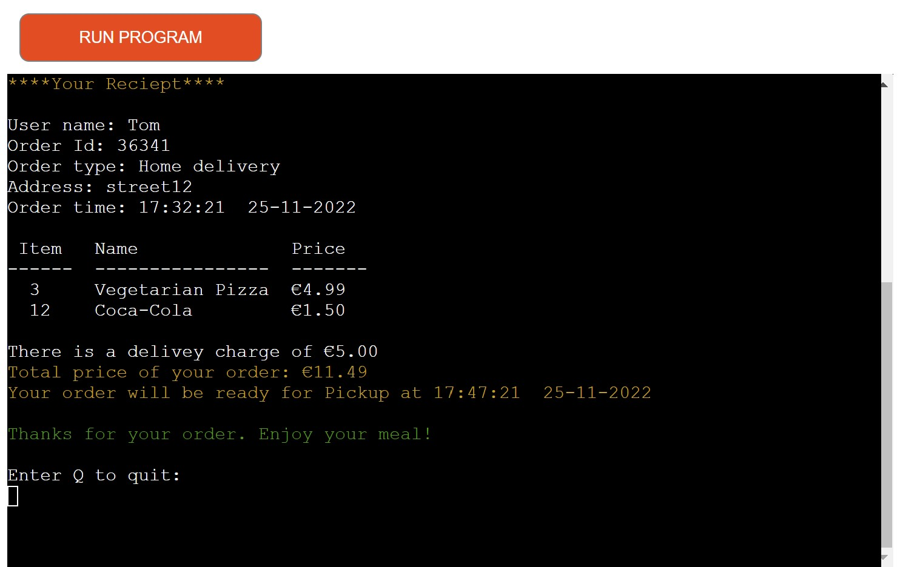

### Display order / delivery time

This feature displays the order time and delivery / pickup time on the order receipt.

Display order / delivery time image

### Quit

This feature is used throughout the app to allow the user to quit the app with a thank you message.

Quit image

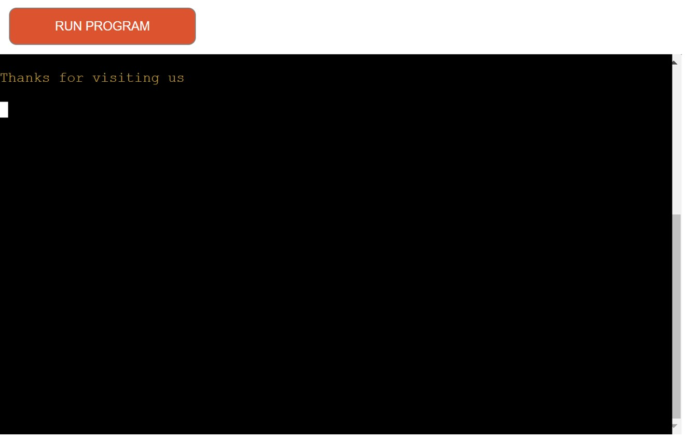

## Python Validation

PEP-8 Validation was used to validate the Python code used in the app.

Python file - run.py

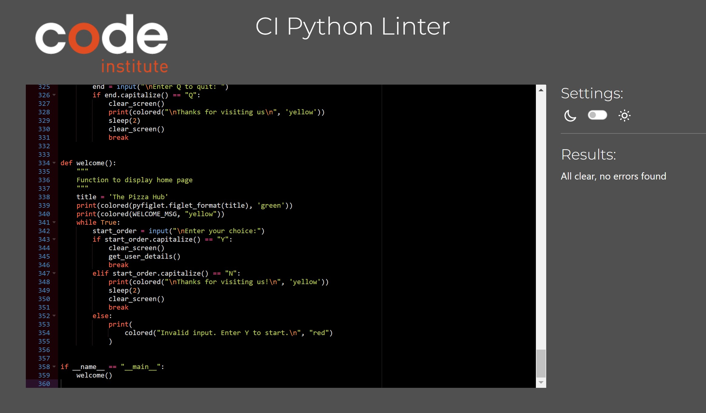

## Testing

### Site User Stories

1. As a user, I want to be provided with clear instructions throughout the app.

| Feature       | Action        | Expected Result  | Actual Result |
| ------------- | ------------- | -------------    | ------------- |
| All listed features in the Features section provide the user with feedback based on user input | As prompted, enter user input | User to be provided with positive and negative feedback based on user input | Works as expected |

2. As a user, I should get an option to choose my order between pickup or home delivery.

| Feature       | Action        | Expected Result  | Actual Result |
| ------------- | ------------- | -------------    | ------------- |
| Order type options | Enter desired order type by entering D for home delivery or P for pickup | If order type Home Delivery is selected, the address is asked for | Works as expected |

3. As a user, I want to view a clear and well-structed menu.

| Feature       | Action        | Expected Result  | Actual Result |
| ------------- | ------------- | -------------    | ------------- |
| Table formatted menu | Enter data when asked for name, address and delivery type | Menu and options to be displayed to the user  |Works as expected |

4. As a user, I want to add an item to the order list. Additionally have the option to remove items from order list.

| Feature       | Action        | Expected Result  | Actual Result |
| ------------- | ------------- | -------------    | ------------- |
| Add item to order list | Enter item number on menu page | User input item to be validated and added to the order list with confirmation message |Works as expected |
| Remove item from order list | Enter item number on preview page | User input item to be validated and removed from the order list with confirmation message |Works as expected |

5. As a user, I want to be able to preview my order.

| Feature       | Action        | Expected Result  | Actual Result |
| ------------- | ------------- | -------------    | ------------- |
|  Preview the order list in table format  | Enter 'P' on menu page | User to be provided with a table of currently selected items for order with the following options:  remove item, add item, confirm order and quit |Works as expected |

6. As a user, I want to be able to see my order receipt.

| Feature       | Action        | Expected Result  | Actual Result |
| ------------- | ------------- | -------------    | ------------- |
|  Order receipt | Enter user name, order type, add item to order list and then from preview page enter 'C' | A formatted page along with user details and order summary will be displayed |Works as expected  |

7. As a user, I want to be able quit the app.

| Feature       | Action        | Expected Result  | Actual Result |
| ------------- | ------------- | -------------    | ------------- |
| Quit | Enter 'Q' either from home page or menu page or preview page or receipt page | A thank you message comes and user exits the app | Works as expected |

----

### Site Owner Stories

1. As a site owner, I want users to be greeted with a welcome message to give the app a friendly experience.

| Feature       | Action        | Expected Result  | Actual Result |
| ------------- | ------------- | -------------    | ------------- |
|  Welcome message  | Run the app   | Title of website and welcome message to be displayed  |Works as expected  |

2. As a site owner, I want to save the user information and order data to a Google Sheets file.

| Feature       | Action        | Expected Result  | Actual Result |
| ------------- | ------------- | -------------    | ------------- |
| Retrieve data | Add user details on main page | Menu is tabulated after retrieving data from worksheet 'menu' | Works as expected |
|Append user data | Add item on menu page | User data and order data provided by the user during the order process is appended to the worksheet 'order_list' | Works as expected |

3. As a site owner, I want the status of the order in Google Sheets worksheet 'order_list' is automatically updated based on user action.

| Feature       | Action        | Expected Result  | Actual Result |
| ------------- | ------------- | -------------    | ------------- |
| Update order status  | Enter item number on menu page | User data & order data for the requested item number is appended to the worksheet 'order_list' and order status of the requested item is set to 'Processing'.| Works as expected |
| Update order status | Enter 'C' either from preview page | In worksheet 'order_list', order status for the items of the specific order id changes to 'Confirmed'.  | Works as expected |
| Update order status | Enter 'Q' either from menu page or preview page | In worksheet 'order_list', order status for the items of the specific order id changes to 'Cancelled'.  | Works as expected |

4. As a site owner, I want users to receive feedback based on their input.

| Feature       | Action        | Expected Result  | Actual Result |
| ------------- | ------------- | -------------    | ------------- |
| Welcome message invalid input | Enter an invalid option on Welcome screen  | User to be provided with feedback about invalid input | Works as expected  |
| Order type options | User input on main page | Shows positive or negative feedback based on user input | Works as expected |
| Menu | User input on menu page | Shows confirmation message for valid input and invalid message for invalid input | Works as expected |
| Preview order | Add an item in the order list and then enter 'P' to go to preview | Preview page is shown when user inputs are valid otherwise feedback is shown based on user input | Works as expected |
| Receipt | Confirm user order on preview page | Upon order completion a formatted page of order summary is displayed | Works as expected  |
| Quit | Enter 'Q' either on home page or menu page or preview page or receipt page  | User exits the app with a thank you message | Works as expected |

## Bugs

| Bug     | Fix       | 
| --------| ------------| 
| Append order confirmation function updates order status for only one item instead of all the items for the specific user in the worksheet 'order_list'  | Use findall function instead of find function for finding user specific order data  |
| When multiple user order in parallel, the preview function displays items being ordered by all users instead of user specific items  |  Generate unique order id for each user and then search all items for specific order id to tabulate user specific order data for preview page  |
| When user removes an item on preview page, the leftover items are appended to the previously added items in the order list  |  Instead of using global variable for retreiving individual user data, use local variable in get individual user data function to fetch current order data for individual user | 
| Sometimes remove item function doesn't remove the desired item on preview page. It works after 2-3 attempts | Use the findall function to find cells with specific item number & specific order ID and subsequently identify common row using sets to ensure removal of specific requested item from worksheet |

## Deployment

### Heroku

This project was deployed to Heroku with following steps:

1. Use the "pip freeze -> requiremnts.txt" command in the terminal to save any libraries that need to be installed in the file.
2. Navigate to https://www.heroku.com/ and login or create an account. 
3. Click the "new" button in the upper right corner and select "create new app".

Screenshot

4. Choose an app name, region and click "Create app".

Screenshot

5. Under Config Vars store any sensitive data which saved in .json file. Name CREDS in Key field, copy the .json file and paste it to 'Value' field. Also add a key 'PORT' and value '8000'.

Screenshot

6. Go to the "settings" tab, add first the Python build pack and then the node.js build pack.

Screenshot

7. Go to the "deploy" tab and pick GitHub as a deployment method.

Screenshot

8. Click the connect button in order to connect it to github.

9. In the "Choose a branch to deploy" section 'main' was auto selected so clicked on deploy branch.

Screenshot

 
10. Wait for the app to build and then click on the "View" link which leads to the deployed link.

----

### Clone a GitHub Repository

I made a local clone of a repository via the following steps:

  - Navigate to www.github.com and log in.
  - Once logged in navigate to the desired [GitHub Repository](https://github.com/jyotiyadav2508/pizza-hub.git)
  - Locate the code button at the top, above the repository file structure.
  - Select the preferred clone method from HTTPS. SSH or GitHub CLI then click the copy button to copy the URL to my clipboard.
  - Open Git terminal
  - Type `git clone` and paste the previously copied URL. I copied HTTPS method.
  - `$ clone https://github.com/jyotiyadav2508/pizza-hub.git`
  - Now press enter and the local clone will be created at the local location.

## Credits

## Acknowledgements

I would like to also thank the following:
  - My Code Institute mentor Mr Sandeep Aggarwal for his guidance through this project.
  - My fellow Code Institute students from whom I got the project idea.
  - My Husband for his support and help in debugging.
  - Code Institute tutor support who helped me with different issues while doing the project.
  

[Back to Top](#the-pizza-hub)
